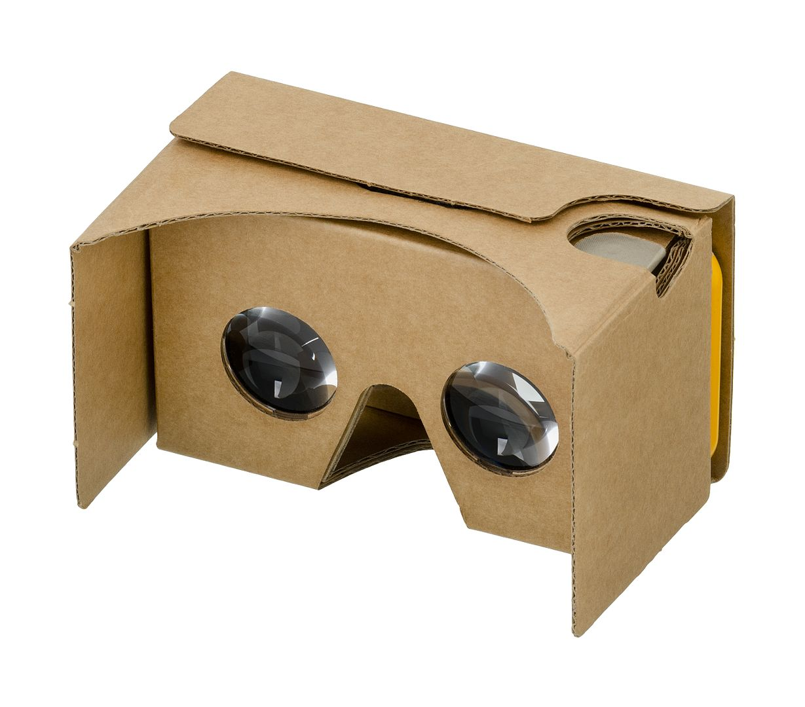

# AR-Prototyping
## AFRAME.js + AR.js

If you are an experience developer, [Unity](https://unity.com/unity/features/ar) is the recommended development environment for AR and VR. There are good examples and boilerplates to get you [started](https://github.com/Unity-Technologies/arfoundation-samples). This repository is using [AFRAME.js](https://aframe.io/) and [AR.js](https://ar-js-org.github.io/AR.js-Docs/) (and [THREE.js](https://threejs.org/) under the hood). Using only web technologies it is easy to get started, also for beginners and it is extremely easy to deploy (its just a website).

## Deploying Prototypes

If you are just getting started and want to experiment, I recommend you fork this repo and activate the [GitHub Pages settings](https://pages.github.com/). GitHub will then host all the examples and your code and you can immediately test it on your mobile device.

## A little introduction

There a different concepts for extending reality (XR) through digital content. XR is the encompassing term describing all approaches. Virtual reality (VR) are applications that seperate reality and the virtual reality completely. While physicial interactions might still happen in the real world. The visual world is completely virtual. Augmented reality (AR) on the other hand, displays digital content on top of the real world. Most of the time the digital content is simply added on top, but in a mixed reality (MR), the real world objects and digital objects are interacting with one another. For example moving something in the real world, also results in an interaction in the digital world. Sometimes MR is also defined by the way you perceive the digital visualisation. While most people use phones and tablets to view AR content, using AR-glasses removes the device-frame and creates a smooth blending between real world and digital content.

### Devices

Source: [Wikipedia](https://en.wikipedia.org/wiki/Google_Cardboard#/media/File:Google-Cardboard.jpg)

For this prototyping approach we will simply use modern smartphones or tablets, nothing special required. If you are interested in prototyping VR content, I recommend buying a cardboard VR. Originally produced by [Google](https://arvr.google.com/cardboard/), cardboard VR sets are now available from various distributors for as cheap as 5 euros. Cardboard VR allows you to transform your phone into a VR headset. More sophisticated AR/VR headsets are:

**VR:**
- [HTC Vive](https://www.vive.com/us/)
- [Facebook Oculus](https://www.oculus.com/quest-2/)
- [HP Reverb](https://www.hp.com/us-en/vr/reverb-g2-vr-headset.html)
- [Valve Index](https://store.steampowered.com/valveindex)
- [PlayStation VR](https://www.playstation.com/en-us/ps-vr/)

**AR**:
- [Microsoft Hololens](https://www.microsoft.com/en-us/hololens/buy)
- [Magic Leap](https://www.magicleap.com/en-us)
- [Vuzix Blade](https://www.vuzix.com/products/vuzix-blade-smart-glasses-upgraded)
- [Epson Moverio](https://www.epson.de/products/see-through-mobile-viewer/moverio-bt-40)

## Overview

**Basic**
- 1. [Basic VR](01_basic_vr/README.md) - [Demo](01_basic_vr/index.html)
- 2. [Basic AR](02_basic_ar/README.md) - [Demo](02_basic_ar/index.html)
- 3. [Marker-based AR](03_marker/README.md) - [Demo](03_marker/index.html)
- 4. [Photo-based AR](04_photo/README.md) - [Demo](04_photo/index.html)
- 5. [Location-based AR](05_location/README.md) - [Demo](05_location/index.html)

**Advanced**
- 6. [Dynamic Content](06_dynamic/README.md) - [Demo](06_dynamic/index.html)
- 7. [Interactions](07_interactions/README.md) - [Demo](07_interactions/index.html)
- 8. [3D-Manipulation](08_3d/README.md) - [Demo](08_3d/index.html)

